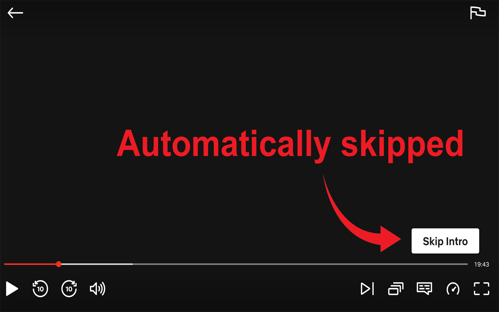
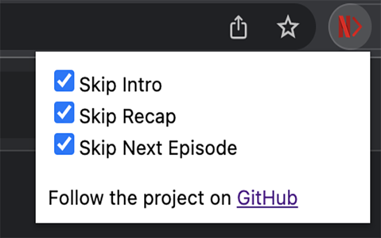

# netflix-skipper
Automatically skip Netflix intros, recaps, and next episode prompts ⚡⌛

Don't waste any more time waiting or clicking on intros, recaps, and next episode buttons.

Once the extension is installed, reload or open a Netflix Tab, and it will work automatically. Through the popup, you can configure which events (intros, recaps, and next episode) you would like to skip. To exclude specific shows from your configured auto-skip settings, you can add the current show's title to an exemption list - or remove it from the list to restore the automatic skipping behavior.

This extension supports ALL Netflix languages!
